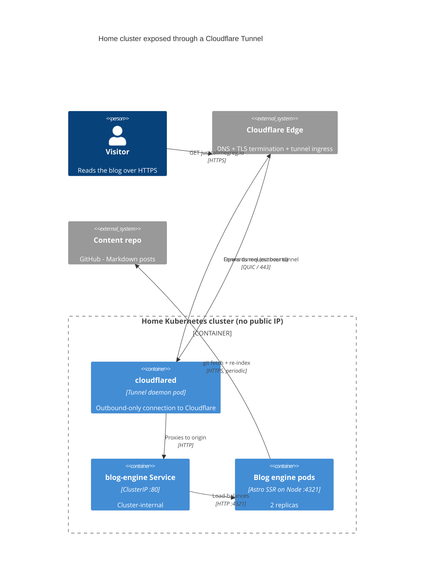
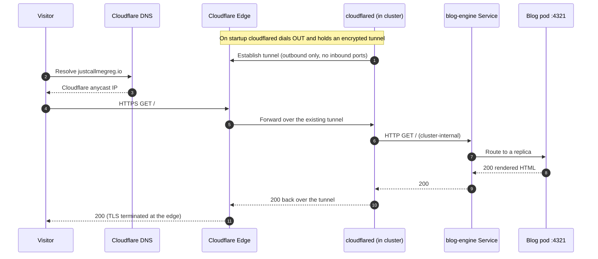

*How a Cloudflare Tunnel puts a home Kubernetes cluster on the public internet without a static IP, port forwarding, or a single open inbound port. This blog is served exactly this way.*

## Problem Statement

This site runs on a small Kubernetes cluster in my house. The blog engine is a container deployed with a Helm chart: a Deployment behind a `ClusterIP` Service on port 80, forwarding to the app on port 4321. Inside the cluster, everything works.

The problem is everything outside the cluster. A home connection is not built to host public services:

- **No fixed public IP.** My ISP hands out a dynamic address that changes, and like many home lines it sits behind CGNAT — so there is no stable, routable IP to point DNS at.
- **Port forwarding is the usual answer, and it is a bad one.** Opening ports 80 and 443 on a home router exposes the network to the whole internet, breaks whenever the IP rotates, and often is not possible at all behind CGNAT.

So the question is narrow and concrete: how does a request for `justcallmegreg.io` reach a pod in my house, over HTTPS, without a public IP and without poking a hole in my firewall?

## Solution

The answer is [`cloudflared`](https://developers.cloudflare.com/cloudflare-tunnel/), Cloudflare's tunnel daemon. It runs as a pod in the same cluster and makes a single **outbound** connection to Cloudflare's edge, then holds it open. Public traffic rides back down that existing connection.

The direction is the whole trick. Nothing on the internet connects *to* my house. `cloudflared` connects *out* to Cloudflare, and Cloudflare forwards requests through the tunnel it is already holding.



Because `cloudflared` can reach the Service directly by its in-cluster DNS name, it also replaces the ingress and load balancer entirely — the chart's Ingress stays disabled. The tunnel *is* the front door.

Here is a single request, end to end:



## Considerations Behind the Solution

**Security.** The home firewall keeps every inbound port closed. The only connection is `cloudflared` reaching out on 443, so the attack surface that port forwarding would have created simply does not exist. TLS is terminated at Cloudflare's edge, which also fronts the site with its CDN and DDoS protection.

**The dynamic IP stops mattering.** DNS points at Cloudflare's anycast network, never at my house. When my ISP rotates the address, the tunnel reconnects and visitors notice nothing — there is no record to update.

**The trade-off.** Traffic now depends on Cloudflare being in the path, and requests take an extra hop through their edge. For a personal blog that is a good deal: I trade a small amount of routing indirection for TLS, a CDN, and never touching my router. The origin stays plain HTTP because it is only ever reachable from inside the cluster.

## Conclusions

A home cluster with no public IP can still serve a real, public HTTPS website. `cloudflared` inverts the connection: instead of the internet reaching in, the cluster reaches out and holds an encrypted tunnel that public requests travel back through. No static IP, no port forwarding, no open inbound ports — and this is the exact path that delivered the page you are reading.

## How Should You Adopt It?

If you already have a cluster with a Service to expose, the setup is short. On a machine with `cloudflared` installed:

1. **Authenticate and create a named tunnel:**
   ```
   cloudflared tunnel login
   cloudflared tunnel create home-cluster
   ```
2. **Map your hostname to the in-cluster Service** in the tunnel's ingress config:
   ```
   ingress:
     - hostname: justcallmegreg.io
       service: http://blog-engine.default.svc.cluster.local:80
     - service: http_status:404
   ```
3. **Point DNS at the tunnel** (Cloudflare creates the record for you):
   ```
   cloudflared tunnel route dns home-cluster justcallmegreg.io
   ```
4. **Run `cloudflared` inside the cluster** as a small Deployment, mounting the tunnel credentials and config as a Secret and ConfigMap. Two replicas give you a highly available tunnel.

That is the entire public-facing setup. Everything else — the Deployment, the Service, TLS between visitor and edge — is already handled by the cluster and by Cloudflare.

Source: https://github.com/justcallmegreg/blog
