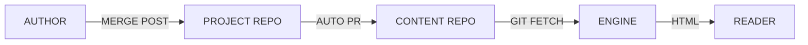
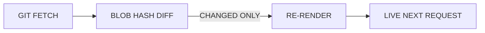

▚▚ ROBCO TERMLINK · TECH BRIEFING ▞▞

# THE BLOG THAT FORGETS EVERYTHING

PUBLISH VIA PULL REQUEST — SERVE WITHOUT A DATABASE

---

## EVERY BLOG PICKS A POISON

- STATIC SITE: PUBLISHING IS A DEPLOY
- EVEN A TYPO FIX RUNS THE PIPELINE
- CMS: YOU NOW OWN A DATABASE
- BACKUPS, MIGRATIONS, PATCHES, ATTACK SURFACE

---

## THE THIRD SHAPE

- PUBLISH = MERGE A PULL REQUEST
- ENGINE: STATELESS, DISPOSABLE CONTAINERS
- CONTENT: PLAIN MARKDOWN IN ITS OWN REPO
- CONTENT OUTLIVES ANY ENGINE VERSION

---

## CONTENT LIVES IN ITS OWN REPO



---

## BOOT: CLONE, RENDER, REMEMBER NOTHING

- CLONE INTO A THROWAWAY DIRECTORY
- RENDER EVERY POST ONCE — INTO RAM
- PUBLISHED DATE = FIRST GIT COMMIT
- KILL THE CONTAINER, LOSE NOTHING

---

## THE SYNC LOOP

EVERY FEW MINUTES — NO REBUILD, NO RESTART, NO DEPLOY



---

<!-- slide: stat -->

# 0

DATABASES · BACKUPS · MIGRATIONS

THE CONTENT REPO IS THE BACKUP — ALREADY VERSIONED

---

## PUBLISHING IS A PULL REQUEST

- DRAFT THE POST INSIDE ITS PROJECT REPO
- MERGE — AN ACTION OPENS THE CONTENT PR
- REVIEW, MERGE AGAIN
- LIVE ON THE NEXT SYNC
- THE ENGINE IS NEVER TOUCHED

---

<!-- slide: two-col -->

## REACH WITHOUT REMEMBERING

- RSS AT /RSS.XML — SAME INDEX
- WEEKLY NEWSLETTER DIGEST
- SIGN-UPS POSTED TO A WEBHOOK
- ZERO EMAILS STORED ON THE SERVER

<!-- col -->

```yaml
# config.yaml
newsletter:
  enabled: true
  summaryDays: 7
  schedule: "every Monday ~09:00"
# emails go to YOUR webhook —
# the engine remembers no one
```

---

## THE TRADE

- BOOT RE-RENDERS ALL, HTML LIVES IN RAM
- FINE FOR A BLOG, NOT 10K POSTS
- GIT HISTORY NOW CARRIES YOUR DATES
- STORAGE IS SOMEONE ELSE'S WEBHOOK

---

## STEAL IT

- CREATE A CONTENT REPO, ADD ONE POST
- RUN THE CONTAINER, POINT CONFIG AT IT
- COPY THE PUBLISH WORKFLOW INTO PROJECTS
- LINK /RSS.XML, WIRE THE NEWSLETTER WEBHOOK

---

<!-- slide: standby -->

# PLEASE STAND BY

GITHUB.COM/JUSTCALLMEGREG/BLOG — THANK YOU, DWELLER
