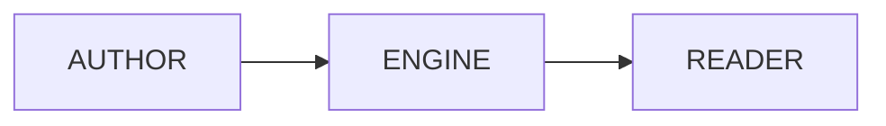

# Deck dialect & Pip-Boy presenter — design

**Status:** approved design (brainstormed 2026-07-09)
**Date:** 2026-07-09

## Summary

"Presentation as code" for Fallout-styled slide decks. A deck is **one Markdown
file** in a small, explicit dialect; a **template** (the Pip-Boy device shell) is
a separate, swappable skin. The renderer between them is a hard boundary, so the
same deck can later render in a different template untouched — and a future
`deck-creator` Claude skill only ever has to emit dialect-compliant Markdown.

Decision record: LaTeX/Beamer was considered and rejected — Mermaid support in
LaTeX exists only via external pre-rendering (`mmdc` / `robust-externalize` +
headless Chromium), the render target is the browser-based Pip-Boy frame (HTML),
and Markdown is far more reliable for LLM generation than compiling TeX.

## Goals

- Deck = generic Markdown content; style = generic template. Strict separation.
- Mermaid diagrams and syntax-highlighted code blocks as first-class content.
- Render target: HTML, inside the Pip-Boy device frame (mockup now, blog engine
  route later).
- Dialect simple and explicit enough that an LLM emits it reliably.

## Non-goals (v1)

- Speaker notes / presenter view, step-wise fragment reveals, PDF export.
- Editorial workflow or a deck-authoring UI.

## The deck dialect

One `.md` file per deck: YAML frontmatter, then slides separated by `---` on its
own line (outside fenced code blocks).

```markdown
---
title: "The Blog That Forgets Everything"
subtitle: "A stateless blog engine"
author: "Greg"
date: "2026-07-09"
theme: pipboy
---

# The Blog That Forgets Everything
A stateless, container-based blog engine

---

## Objectives
- Survive the quarterly review
- Ship the water chip on schedule

---

## Architecture


---

<!-- slide: stat -->
# 99.7%
Audience retention

---

<!-- slide: two-col -->
## Agenda
Left column content…
<!-- col -->
Right column content…
```

### Frontmatter

| Field      | Required | Notes                                   |
|------------|----------|-----------------------------------------|
| `title`    | yes      | Falls back to the first slide's H1      |
| `subtitle` | no       |                                         |
| `author`   | no       |                                         |
| `date`     | no       | `YYYY-MM-DD` string, quoted             |
| `theme`    | no       | Template selector; default `pipboy`     |

### Layout rules — few and explicit

- A slide's layout comes from a directive comment as the slide's first line:
  `<!-- slide: title | default | stat | two-col | standby -->`.
- No directive → `default`. **The only implicit rule:** slide 1 with no
  directive → `title`.
- **v1 layouts (5):**
  - `title` — deck opener: eyebrow/H1/subtitle centered.
  - `default` — heading + flowing content (lists, paragraphs, code, mermaid,
    images).
  - `stat` — one huge number/short phrase (H1) + label + optional footnote.
  - `two-col` — content split at a `<!-- col -->` comment into two columns.
  - `standby` — closer: centered emblem + H1 + sub line.
- Mermaid: fenced ```` ```mermaid ```` blocks (rendered by the runtime, themed).
- Code: fenced blocks with a language → Shiki highlighting.
- Images: standard Markdown; assets live in a folder next to the deck
  (`decks/<slug>/assets/…`), same convention as blog posts.

### Error handling

- Unknown/malformed layout directive → render as `default` + console warning.
- Missing frontmatter `title` → derive from first H1; still renders.
- A deck never hard-fails on a bad slide; worst case is an ugly `default` slide.

## The template contract

Hard boundary between renderer and skin:

```
renderDeck(markdown) → { meta, slides: [{ layout, html }] }
```

- **Renderer** (template-agnostic): parse frontmatter, split slides on `---`
  (ignoring fenced code), read/strip the layout directive, render each slide's
  Markdown to HTML. Knows nothing about any device.
- **Template** (skin): consumes `{ meta, slides }` and must provide:
  1. The frame/chrome (device, bezel, whatever the theme is).
  2. CSS for the five layout classes: `.slide--title`, `.slide--default`,
     `.slide--stat`, `.slide--two-col`, `.slide--standby`.
  3. Navigation wiring that calls `deck.next()` / `deck.prev()` (keys, click
     zones, buttons — template's choice).
  4. A progress binding (index/total) — the Pip-Boy maps it to the gauge needle
     and counter.
  5. Optional hooks: slide-transition effect (CRT wipe) and switch sound (the
     Pip-Boy click).
- The Pip-Boy is template #1. A second template is a new shell + CSS; decks are
  untouched.

## Phases

1. **Mockup retrofit (now, artifact):** embed a demo `deck.md` in the Pip-Boy
   mockup and generate its slides from the dialect with a small client-side
   renderer (subset of Markdown sufficient for the demo deck) — proving
   dialect → renderer → template end-to-end in one self-contained file.
2. **Blog-engine route:** `/decks/<slug>` — server renders each slide with the
   existing remark/rehype/Shiki pipeline + existing Fallout Mermaid runtime;
   Pip-Boy shell becomes an Astro layout; decks live in the content repo under
   `decks/<slug>/index.md` and ride the existing publish-PR flow (and gain
   `publishAt` scheduling for free).
3. **`deck-creator` Claude skill:** sibling of `blogpost-creator`; investigates
   a repo/topic and emits a dialect-compliant deck. This spec is its
   instruction set.

## Testing

- Renderer (phase 2, lib-level like the rest of the repo): frontmatter parsing,
  slide splitting (incl. `---` inside fenced code not splitting), directive
  parsing + unknown-layout fallback, title fallback from H1, two-col splitting.
- Template behavior (mockup/phase 1): manual + browser-driven checks — nav,
  gauge sweep, knob rotation, sound trigger, all five layouts render.
